# HR Capability Map — 设计与实现文档

> 同步日期：2026-06-03  
> JDL 文件：`hr-capability-map.jdl`  
> 前端框架：Vue 3 + BootstrapVue Next  
> 后端框架：Spring Boot 4.0.6 + Hibernate + Liquibase  
> Java 版本：JDK 21  
> 代码生成：JHipster 9.1

---

## 1. 项目概述

面向新人培养与人员能力管理的工作台工具。系统围绕**职位（Position）** 和**人员（Person）** 两大核心实体，管理技能定义、技能等级、职位所需技能、任职人员、人员技能、替代关系、继任计划、岗位/人员风险、培训目标/记录、技能评估、信任观察、评价考核等业务数据。

本期是个人试行项目，用于辅助个人进行人员能力观察、岗位替代风险判断和培养方向整理。本期不设计权限与敏感信息边界，不强化审计和合规控制；相关内容仅作为后续正式化议题保留。

---

## 2. 技术栈

| 层次           | 技术                                        |
| -------------- | ------------------------------------------- |
| 前端框架       | Vue 3 + TypeScript                          |
| UI 组件        | BootstrapVue Next                           |
| 表单验证       | Vuelidate                                   |
| 国际化         | vue-i18n@9                                  |
| 构建工具       | Vite + Rolldown                             |
| HTTP 客户端    | Axios                                       |
| 后端框架       | Spring Boot 4.0.6                           |
| Java           | JDK 21                                      |
| ORM            | Hibernate + JPA                             |
| DTO 映射       | MapStruct                                   |
| 数据库迁移     | Liquibase                                   |
| 数据库（开发） | H2 Database (LEGACY 模式)                   |
| 数据库（生产） | MariaDB                                     |
| 代码生成       | JHipster 9.1 (JDL → 实体/REST/Service/前端) |

---

## 3. 实体全景

系统包含 **19 个业务实体**（Authority、User 为 JHipster 内置，不在此列）。  
`PositionSkillRequirement`、`PositionAssignment`、`PersonSkill` 不再作为独立业务功能存在，其维护动作内嵌到 `Position` 和 `Person` 页面中。

```mermaid
graph TD
    subgraph 核心
        Position
        Person
        Skill
        SkillLevel
    end

    subgraph 继任与匹配
        PositionMatch --> Person
        PositionMatch --> Position
        SuccessionCandidate --> Position
        SuccessionCandidate --> Person
        CandidateProfile --> Person
        CandidateProfile --> Position
    end

    subgraph 风险
        PositionRisk --> Position
        PositionRisk --> KeyResponsibilityCategory
        PersonRisk --> Person
        PersonRisk --> Position
        PositionRiskEvaluation --> Position
    end

    subgraph 培训与技能发展
        TrainingGoal --> Person
        TrainingGoal --> Position
        TrainingGoal --> Skill
        TrainingGoal --> SkillLevel
        TrainingRecord --> Person
        TrainingRecord --> TrainingGoal
        TrainingRecord --> Position
        SkillUpgradeRecord --> Person
        SkillUpgradeRecord --> Skill
        SkillUpgradeRecord --> SkillLevel
        SkillAssessment --> Person
        SkillAssessment --> Skill
        SkillAssessment --> SkillLevel
    end

    subgraph 评估与观察
        TrustObservation --> Person
        Evaluation --> Person
        Evaluation --> TrainingGoal
        ImprovementPlan --> Position
        ImprovementPlan --> Skill
    end

    subgraph 替代
        StaffSubstitution --> Position
        StaffSubstitution --> Person
    end
```



---

## 4. 实体详情

### 4.1 Position（职位）

| 字段               | 类型            | 约束             | 说明                                            |
| ------------------ | --------------- | ---------------- | ----------------------------------------------- |
| positionCode       | String(50)      | UNIQUE, NOT NULL | 职位编码                                        |
| positionName       | String(100)     | NOT NULL         | 职位名称                                        |
| positionType       | PositionType    | NOT NULL         | 类型：技术/业务支持/客户接口/管理支持/导师/其他 |
| businessImportance | ImportanceLevel | NOT NULL         | 业务重要性                                      |
| keyPosition        | Boolean         | NOT NULL         | 是否关键职位                                    |
| description        | Text            |                  | 职位描述                                        |
| plannedHeadcount   | Integer         | min(0)           | 计划编制人数                                    |
| minimumOwnerCount  | Integer         | min(0)           | 最低在岗人数                                    |
| reviewCycle        | ReviewCycle     |                  | 复核周期                                        |
| active             | Boolean         | NOT NULL         | 是否启用                                        |

**关系：**

- 1:N → PositionRiskEvaluation
- 1:N → PositionMatch, SuccessionCandidate, PositionRisk, ImprovementPlan
- 参考方：TrainingGoal, TrainingRecord, Evaluation

**业务维护方式：**

- Position 创建 / 编辑页内嵌维护 `所需技能 + 等级门槛` 子表格。
- Position 创建 / 编辑页内嵌维护 `任职人员` 子表格。
- `PositionSkillRequirement`、`PositionAssignment` 不再作为独立菜单功能开放。

### 4.2 Person（人员）

| 字段              | 类型             | 约束     | 说明           |
| ----------------- | ---------------- | -------- | -------------- |
| employeeCode      | String(50)       | UNIQUE   | 员工编号       |
| personName        | String(100)      | NOT NULL | 姓名           |
| age               | Integer          | 0–120    | 年龄           |
| gender            | Gender           |          | 性别           |
| department        | String(100)      |          | 部门           |
| currentRole       | String(100)      |          | 当前岗位/角色  |
| employmentStatus  | EmploymentStatus | NOT NULL | 任职状态       |
| joinDate          | LocalDate        |          | 入职日期       |
| mentorFlag        | Boolean          | NOT NULL | 是否导师       |
| coreCandidateFlag | Boolean          | NOT NULL | 是否核心候选人 |
| note              | Text             |          | 备注           |

**关联方（作为外键被引用方）：**

- PositionMatch.person
- SuccessionCandidate.candidate / currentOwner
- PersonRisk.person, StaffSubstitution.candidatePerson（目标模型）
- TrainingGoal.person, TrainingRecord.person / mentor
- SkillUpgradeRecord.person / assessor, SkillAssessment.person / assessor
- TrustObservation.person / observer, Evaluation.person / evaluator
- CandidateProfile.person / observer

**业务维护方式：**

- Person 创建 / 编辑页内嵌维护 `技能 + 当前等级 + 评估日期` 子表格。
- `PersonSkill` 不再作为独立菜单功能开放。

### 4.3 Skill（技能）

| 字段           | 类型         | 约束             | 说明                                |
| -------------- | ------------ | ---------------- | ----------------------------------- |
| skillCode      | String(50)   | UNIQUE, NOT NULL | 技能编码                            |
| skillName      | String(100)  | NOT NULL         | 技能名称                            |
| skillType      | SkillType    | NOT NULL         | 类型：证书/技术/业务/抽象/导师/其他 |
| measurableFlag | Boolean      | NOT NULL         | 是否可量化                          |
| description    | Text         |                  | 描述                                |
| evidenceType   | EvidenceType |                  | 证据类型                            |

### 4.4 SkillLevel（技能等级）

| 字段               | 类型        | 约束             | 说明           |
| ------------------ | ----------- | ---------------- | -------------- |
| code               | LevelCode   | UNIQUE, NOT NULL | 等级编码 L0–L4 |
| levelName          | String(100) | NOT NULL         | 等级名称       |
| definition         | Text        |                  | 等级定义       |
| observableEvidence | Text        |                  | 可观察证据     |
| sortOrder          | Integer     | NOT NULL, min(0) | 排序号         |

**等级含义：**
| 等级 | 含义 |
|------|------|
| L0 | 未掌握 |
| L1 | 在指导下可以完成 |
| L2 | 可以独立完成常规任务 |
| L3 | 可以处理复杂问题并指导他人 |
| L4 | 可以设计流程、培养他人、形成方法论 |

### 4.5 Person 技能内嵌项（业务维护模型）

| 字段            | 类型            | 约束     | 说明         |
| --------------- | --------------- | -------- | ------------ |
| skill           | Skill           | NOT NULL | 技能         |
| currentLevel    | SkillLevel      | NOT NULL | 当前等级     |
| assessmentDate  | LocalDate       | NOT NULL | 评估日期     |
| nextReviewDate  | LocalDate       |          | 下次复核日期 |
| evidence        | Text            |          | 证明         |
| confidence      | ConfidenceLevel |          | 信心水平     |
| growthDirection | Text            |          | 成长方向     |

**前端 UX：**

- Person 编辑页内嵌技能子表单，支持 add/remove 行
- 同一人员不允许重复录入同一 Skill
- `PersonSkill` 不再作为独立列表/详情/编辑功能存在

**业务约束：**

- 同一人员的技能列表以 `person + skill` 唯一约束维护，当前等级始终只有一份主记录。

### 4.6 Position 所需技能内嵌项（业务维护模型）

| 字段          | 类型                  | 约束     | 说明                   |
| ------------- | --------------------- | -------- | ---------------------- |
| skill         | Skill                 | NOT NULL | 技能                   |
| requiredLevel | SkillLevel            | NOT NULL | 最低要求等级           |
| importance    | RequirementImportance | NOT NULL | 重要性：必需/重要/可选 |
| remark        | Text                  |          | 备注                   |

**前端 UX：**

- Position 编辑页内嵌所需技能子表单，支持 add/remove 行
- 同一职位不允许重复录入同一 Skill
- `PositionSkillRequirement` 不再作为独立列表/详情/编辑功能存在

### 4.7 Position 任职人员内嵌项（业务维护模型）

| 字段                | 类型      | 约束     | 说明           |
| ------------------- | --------- | -------- | -------------- |
| person              | Person    | NOT NULL | 任职人员       |
| primaryOwner        | Boolean   | NOT NULL | 是否主要负责人 |
| startDate           | LocalDate |          | 开始日期       |
| endDate             | LocalDate |          | 结束日期       |
| responsibilityScope | Text      |          | 职责范围       |
| active              | Boolean   | NOT NULL | 是否当前有效   |

**前端 UX：**

- Position 编辑页内嵌任职人员子表单，支持添加/移除
- 同一职位下，同一人员不允许录入重复的当前有效记录
- `PositionAssignment` 不再作为独立列表/详情/编辑功能存在

**业务约束：**

- “当前有效任职人员”判定规则为：`active = true`，且 `endDate` 为空或 `endDate >= 当天`。

### 4.8 PositionMatch（人岗匹配）

| 字段           | 类型           | 约束     | 说明       |
| -------------- | -------------- | -------- | ---------- |
| matchScore     | Integer        | 0–100    | 匹配分数   |
| matchedSkills  | Text           |          | 已匹配技能 |
| gapSkills      | Text           |          | 差距技能   |
| readiness      | ReadinessLevel | NOT NULL | 就绪程度   |
| recommendation | Recommendation | NOT NULL | 推荐结论   |
| analysisDate   | LocalDate      | NOT NULL | 分析日期   |
| remark         | Text           |          | 备注       |

### 4.9 SuccessionCandidate（继任候选人）

| 字段                 | 类型           | 约束     | 说明         |
| -------------------- | -------------- | -------- | ------------ |
| successionReadiness  | ReadinessLevel | NOT NULL | 继任就绪度   |
| requiredTraining     | Text           |          | 所需培训     |
| estimatedTimeToReady | String(100)    |          | 预计到岗时间 |
| riskAfterTraining    | RiskLevel      |          | 培训后风险   |
| reviewDate           | LocalDate      |          | 复核日期     |
| priority             | Integer        | min(1)   | 优先级       |

**前端 UX：**

- Candidate 下拉框排除 currentOwner（候选人不能是现任）
- 保存前校验 candidate !== currentOwner

### 4.10 PositionRisk（岗位风险）

| 字段                       | 类型            | 约束     | 说明            |
| -------------------------- | --------------- | -------- | --------------- |
| riskType                   | RiskType        | NOT NULL | 风险类型        |
| riskLevel                  | RiskLevel       | NOT NULL | 风险等级        |
| documentStatus             | DocumentStatus  |          | 文档状态        |
| backupStatus               | BackupStatus    |          | 备份状态        |
| customerOrSystemDependency | ImportanceLevel |          | 客户/系统依赖度 |
| riskDescription            | Text            |          | 风险说明        |
| improvementAction          | Text            |          | 改进措施        |
| identifiedDate             | LocalDate       | NOT NULL | 识别日期        |
| targetDate                 | LocalDate       |          | 目标日期        |
| closedDate                 | LocalDate       |          | 关闭日期        |

### 4.11 PersonRisk（人员风险）

| 字段              | 类型      | 约束     | 说明     |
| ----------------- | --------- | -------- | -------- |
| riskType          | RiskType  | NOT NULL | 风险类型 |
| riskLevel         | RiskLevel | NOT NULL | 风险等级 |
| riskDescription   | Text      |          | 风险说明 |
| improvementAction | Text      |          | 改进措施 |
| identifiedDate    | LocalDate | NOT NULL | 识别日期 |
| targetDate        | LocalDate |          | 目标日期 |
| closedDate        | LocalDate |          | 关闭日期 |

**前端 UX：**

- Person 选择后自动读取 Person.currentRole，并优先带出当前关联职位
- 表单分为 Personal Info（人员信息卡片 + 自动填充位置）和 Risk Info 两段

### 4.12 SkillUpgradeRecord（技能升级记录）

| 字段             | 类型            | 约束     | 说明                   |
| ---------------- | --------------- | -------- | ---------------------- |
| changeType       | SkillChangeType | NOT NULL | 变更类型               |
| changeDate       | LocalDate       | NOT NULL | 变更日期               |
| reason           | String(200)     | NOT NULL | 原因                   |
| beforeLevelLabel | String(50)      |          | 变更前等级（冗余快照） |
| afterLevelLabel  | String(50)      |          | 变更后等级（冗余快照） |
| evidence         | Text            |          | 证明                   |
| comment          | Text            |          | 备注                   |

**关系：**

- person（Person, NOT NULL）
- skill（Skill, NOT NULL）
- oldLevel（SkillLevel, LAZY）
- newLevel（SkillLevel, NOT NULL）
- assessor（Person, LAZY）

**前端 UX：**

- 独立 Person 选择器 → Skill 下拉框按 Person 过滤 → 人员信息卡片
- Person 和 Skill 选择区域与 Upgrade Details 以分割线分隔
- 保存后同步刷新 Person 页面中的该技能当前等级

### 4.13 StaffSubstitution（职位替代关系）

目标设计中，替代评价围绕指定职位进行，不再对两名人员进行整体比较。候选人员是否可替代，应根据目标职位的技能要求与候选人员已有技能进行覆盖率计算。覆盖率仅作为画面计算项展示，不作为独立结构化字段长期维护。

> 实现状态：已同步为 position + candidatePerson 的职位替代评价模型。后端通过 `/api/staff-substitutions/calculate` 根据职位技能要求和候选人员技能计算覆盖率、缺失技能和是否可替代；前端新增记录时选择目标职位和候选人员后计算保存，计算字段只读展示。  
> 设计调整：当前实现仍保留 coverageRate / totalSkillCount / coveredSkillCount / missingSkills 结构化字段；按本版设计，后续应将其收敛为画面计算项，并把每次评价结果追加写入 `reason` 历史备注。

| 字段           | 类型       | 约束            | 说明                                                       |
| -------------- | ---------- | --------------- | ---------------------------------------------------------- |
| thresholdRate  | BigDecimal | NOT NULL, 0–100 | 阈值                                                       |
| substitutable  | Boolean    | NOT NULL        | 是否可替代                                                 |
| evaluationDate | LocalDate  | NOT NULL        | 评定日期                                                   |
| reason         | Text       |                 | 备注字段，追加保存每次评价时间、覆盖率、缺失技能和判断说明 |

**目标关系：**

- position（Position, NOT NULL）— 被替代的目标职位
- candidatePerson（Person, NOT NULL）— 候选替代人员

**画面计算项（不作为独立长期维护字段）：**

- coverageRate
- totalSkillCount
- coveredSkillCount
- missingSkills

**业务规则：**

- 覆盖率 = 覆盖技能数 / 总技能数 × 100
- 技能覆盖成立条件：candidatePerson 拥有目标职位要求的同技能，且等级 >= Position 页面内嵌维护的 requiredLevel
- 替代关系成立条件：coverageRate >= 80（thresholdRate）
- 本期暂不引入技能权重，所有职位技能要求按同等权重参与覆盖率计算
- 替代评价记录不设置固定有效期限，是否需要重新评价由使用者根据岗位、人员或技能变化自行判断
- 同一 `position + candidatePerson` 在业务上只保留一条主记录；重复评价时更新同一条数据，不新建多条历史实体
- 新的评价结果按时间顺序追加到 `reason` 中，保留原有文字历史
- 建议追加格式：`[YYYY-MM-DD] coverage=85%, missing=SkillA/SkillB, result=SUBSTITUTABLE, note=...`
- 当 `totalSkillCount == 0`（职位无技能要求）时，覆盖率直接为 100%，候选人员自动视为可替代（2026-06-04 修正：原实现返回 BigDecimal.ZERO 导致无技能要求的职位永远不可替代）
- **唯一约束**：同一 `(position_id, candidate_person_id)` 在数据库层面通过 `addUniqueConstraint` 强制唯一；JPA 实体通过 `@Table(uniqueConstraints = ...)` 声明；REST POST 接口在 Service 层做重复检查，重复时执行更新而非创建新记录（2026-06-04 实现）

### 4.14 PositionRiskEvaluation（职位风险评价）

| 字段                       | 类型            | 约束     | 说明                   |
| -------------------------- | --------------- | -------- | ---------------------- |
| evaluationDate             | LocalDate       | NOT NULL | 评价日期               |
| ownerCount                 | Integer         | min(0)   | 在岗人数（自动计算）   |
| substitutableOwnerCount    | Integer         | min(0)   | 可替代人数（自动计算） |
| hasSubstitute              | Boolean         | NOT NULL | 是否有替代             |
| documentStatus             | DocumentStatus  |          | 文档状态               |
| customerOrSystemDependency | ImportanceLevel |          | 客户 / 系统依赖度      |
| successionReadiness        | ReadinessLevel  |          | 后继者准备度           |
| riskLevel                  | RiskLevel       | NOT NULL | 风险等级               |
| riskReason                 | Text            |          | 风险理由               |
| recommendedAction          | Text            |          | 推荐措施               |

**前端 UX：**

- Position 作为主键置顶显示。
- ownerCount / substitutableOwnerCount 为自动计算只读字段，选择 Position 后通过读取 Position 页面维护的当前任职人员和 StaffSubstitution 实时填充。
- documentStatus、customerOrSystemDependency、successionReadiness 由使用者在评价时录入，用于简单规则判定。

**风险判定规则：**

本期使用简单决策表，不引入复杂评分模型。

| 条件                                                                                    | 风险   |
| --------------------------------------------------------------------------------------- | ------ |
| ownerCount = 0                                                                          | HIGH   |
| keyPosition = true，且 ownerCount < minimumOwnerCount                                   | HIGH   |
| keyPosition = true，且 hasSubstitute = false                                            | HIGH   |
| documentStatus = MISSING / OUTDATED，且 customerOrSystemDependency = HIGH               | HIGH   |
| successionReadiness = NONE，且 customerOrSystemDependency = HIGH                        | HIGH   |
| keyPosition = false，且 ownerCount < minimumOwnerCount                                  | MEDIUM |
| 有部分替代或后继者培养中，但尚不能立即接替                                              | MEDIUM |
| documentStatus = PARTIAL，或 customerOrSystemDependency = MEDIUM                        | MEDIUM |
| ownerCount >= minimumOwnerCount，且 hasSubstitute = true，且 documentStatus = AVAILABLE | LOW    |

### 4.15 TrainingGoal（培训目标）

| 字段                   | 类型        | 约束     | 说明         |
| ---------------------- | ----------- | -------- | ------------ |
| goalName               | String(150) | NOT NULL | 目标名称     |
| goalDescription        | Text        |          | 目标描述     |
| targetLevelDescription | Text        |          | 目标等级说明 |
| startDate              | LocalDate   |          | 开始日期     |
| targetDate             | LocalDate   |          | 目标日期     |
| status                 | PlanStatus  | NOT NULL | 状态         |

**前端 UX：**

- 多人员选择器（add/remove），添加时自动显示当前职位和技能组
- 保存时为每位参与人员创建独立记录

### 4.16 TrainingRecord（培训记录）

| 字段              | 类型         | 约束     | 说明     |
| ----------------- | ------------ | -------- | -------- |
| trainingDate      | LocalDate    | NOT NULL | 培训日期 |
| trainingType      | TrainingType | NOT NULL | 培训类型 |
| topic             | String(150)  | NOT NULL | 主题     |
| taskDescription   | Text         |          | 任务说明 |
| resultDescription | Text         |          | 结果说明 |
| evidence          | Text         |          | 证明     |
| nextAction        | Text         |          | 后续行动 |

**前端 UX：**

- 多人员选择器，添加时自动显示人员姓名和当前职位

### 4.17 SkillAssessment（技能评估）

| 字段           | 类型             | 约束     | 说明     |
| -------------- | ---------------- | -------- | -------- |
| assessmentDate | LocalDate        | NOT NULL | 评估日期 |
| result         | AssessmentResult | NOT NULL | 评估结果 |
| evidence       | Text             |          | 证明     |
| comment        | Text             |          | 备注     |

**关系：**

- person（Person, LAZY）
- skill（Skill, LAZY）
- assessor（Person, LAZY）
- newLevel（SkillLevel, LAZY）

**前端 UX：**

- Person 选择后，Skill 下拉框仅显示该人员当前已维护的技能
- 选择 newLevel 后自动同步更新 Person 页面中的对应技能等级和 assessmentDate

### 4.18 TrustObservation（信任观察）

| 字段                 | 类型       | 约束     | 说明         |
| -------------------- | ---------- | -------- | ------------ |
| observationDate      | LocalDate  | NOT NULL | 观察日期     |
| trustStage           | TrustStage | NOT NULL | 信任阶段     |
| observedBehavior     | Text       |          | 观察到的行为 |
| positiveSignal       | Text       |          | 正向信号     |
| riskSignal           | Text       |          | 风险信号     |
| nextObservationPoint | Text       |          | 下次观察要点 |

### 4.19 Evaluation（评价考核）

| 字段                     | 类型             | 约束     | 说明         |
| ------------------------ | ---------------- | -------- | ------------ |
| evaluationName           | String(150)      | NOT NULL | 评价名称     |
| evaluationDate           | LocalDate        | NOT NULL | 评价日期     |
| periodLabel              | String(100)      |          | 周期标签     |
| progressStatus           | ProgressStatus   |          | 进度状态     |
| result                   | AssessmentResult |          | 结果         |
| strengths                | Text             |          | 优势         |
| weaknesses               | Text             |          | 劣势         |
| supportNeeded            | Text             |          | 所需支持     |
| nextTrainingFocus        | Text             |          | 下次培训重点 |
| positionAdjustmentNeeded | Boolean          |          | 是否需要调岗 |

### 4.20 ImprovementPlan（改善计划）

| 字段              | 类型        | 约束     | 说明     |
| ----------------- | ----------- | -------- | -------- |
| planName          | String(150) | NOT NULL | 计划名称 |
| planStatus        | PlanStatus  | NOT NULL | 状态     |
| problemSummary    | Text        |          | 问题总结 |
| improvementAction | Text        |          | 改善措施 |
| ownerName         | String(100) |          | 负责人   |
| startDate         | LocalDate   |          | 开始日期 |
| targetDate        | LocalDate   |          | 目标日期 |
| completionDate    | LocalDate   |          | 完成日期 |
| reviewResult      | Text        |          | 复核结果 |

### 4.21 KeyResponsibilityCategory（关键职责分类）

| 字段         | 类型        | 约束             | 说明       |
| ------------ | ----------- | ---------------- | ---------- |
| categoryName | String(100) | UNIQUE, NOT NULL | 分类名称   |
| examples     | Text        |                  | 示例       |
| riskFocus    | Text        |                  | 风险关注点 |

### 4.22 CandidateProfile（候选人画像）

| 字段                      | 类型               | 约束     | 说明     |
| ------------------------- | ------------------ | -------- | -------- |
| candidateDate             | LocalDate          | NOT NULL | 评估日期 |
| cultivateDirection        | String(150)        |          | 培养方向 |
| stability                 | ImportanceLevel    |          | 稳定性   |
| learningAbility           | ImportanceLevel    |          | 学习能力 |
| communicationCoordination | ImportanceLevel    |          | 沟通协调 |
| businessUnderstanding     | ImportanceLevel    |          | 业务理解 |
| responsibility            | ImportanceLevel    |          | 责任心   |
| riskAwareness             | ImportanceLevel    |          | 风险意识 |
| judgement                 | CandidateJudgement | NOT NULL | 综合判断 |
| evidence                  | Text               |          | 证明     |

---

## 5. 枚举汇总

| 枚举                  | 取值                                                                                                                                                                             | 用途         |
| --------------------- | -------------------------------------------------------------------------------------------------------------------------------------------------------------------------------- | ------------ |
| Gender                | MALE, FEMALE, UNSPECIFIED                                                                                                                                                        | 人员性别     |
| PositionType          | TECHNICAL, BUSINESS_SUPPORT, CUSTOMER_INTERFACE, MANAGEMENT_SUPPORT, MENTOR, OTHER                                                                                               | 职位类型     |
| ImportanceLevel       | HIGH, MEDIUM, LOW                                                                                                                                                                | 通用重要等级 |
| ReviewCycle           | MONTHLY, QUARTERLY, SEMIANNUAL, ANNUAL, ON_CHANGE                                                                                                                                | 复核周期     |
| EmploymentStatus      | NEWCOMER, INDEPENDENT_STAFF, CORE_STAFF, MANAGEMENT_CANDIDATE, OBSERVE                                                                                                           | 任职状态     |
| SkillType             | CERTIFICATE, TECHNICAL, BUSINESS, ABSTRACT, MENTORING, OTHER                                                                                                                     | 技能类型     |
| EvidenceType          | CERTIFICATE, PROJECT_EXPERIENCE, OBSERVATION, ASSESSMENT_RESULT, OTHER                                                                                                           | 证据类型     |
| LevelCode             | L0, L1, L2, L3, L4                                                                                                                                                               | 等级编码     |
| ConfidenceLevel       | HIGH, MEDIUM, LOW                                                                                                                                                                | 信心水平     |
| RequirementImportance | REQUIRED, IMPORTANT, OPTIONAL                                                                                                                                                    | 要求重要性   |
| ReadinessLevel        | IMMEDIATE, THREE_MONTHS, SIX_TO_TWELVE_MONTHS, NONE                                                                                                                              | 就绪度       |
| Recommendation        | FIT, TRAINABLE, NOT_FIT, OBSERVE                                                                                                                                                 | 推荐结论     |
| RiskLevel             | LOW, MEDIUM, HIGH, UNKNOWN                                                                                                                                                       | 风险等级     |
| RiskType              | SINGLE_POINT, KNOWLEDGE_CONCENTRATION, CUSTOMER_RELATION_CONCENTRATION, PERMISSION_CONCENTRATION, SUCCESSOR_SHORTAGE, HEALTH_CONTINUITY, UNCLEAR_RESPONSIBILITY, TURNOVER, OTHER | 风险类型     |
| DocumentStatus        | AVAILABLE, PARTIAL, MISSING, OUTDATED                                                                                                                                            | 文档状态     |
| BackupStatus          | AVAILABLE, PARTIAL, MISSING, NOT_APPLICABLE                                                                                                                                      | 备份状态     |
| CandidateJudgement    | CORE_CANDIDATE, OBSERVE, NOT_SUITABLE                                                                                                                                            | 候选人判定   |
| AssessmentResult      | PASS, WARNING, FAIL, OBSERVE                                                                                                                                                     | 评估结果     |
| ProgressStatus        | NORMAL, SLOW, FAST, RISK                                                                                                                                                         | 进度状态     |
| PlanStatus            | DRAFT, ACTIVE, COMPLETED, CANCELLED                                                                                                                                              | 计划状态     |
| SkillChangeType       | NEW_SKILL, LEVEL_UP, LEVEL_DOWN, REASSESSMENT, CORRECTION                                                                                                                        | 技能变更类型 |
| TrainingType          | ONBOARDING, SHADOWING, CASE_REVIEW, PRACTICE, MEETING, DOCUMENTATION, OTHER                                                                                                      | 培训类型     |
| TrustStage            | S0_UNOBSERVED, S1_BASIC_TRUST, S2_TASK_TRUST, S3_RESPONSIBILITY_TRUST, S4_KEY_TRUST                                                                                              | 信任阶段     |

---

## 6. 关系全景

所有业务关系均为 **ManyToOne**（N:1），共计 **40 条**：

| 源实体                 | 关系字段        | 目标实体                  | 非空 | 说明         |
| ---------------------- | --------------- | ------------------------- | ---- | ------------ |
| PositionMatch          | person          | Person                    | ✓    |              |
| PositionMatch          | position        | Position                  | ✓    |              |
| SuccessionCandidate    | position        | Position                  | ✓    |              |
| SuccessionCandidate    | currentOwner    | Person                    |      |              |
| SuccessionCandidate    | candidate       | Person                    | ✓    |              |
| PositionRisk           | position        | Position                  | ✓    |              |
| PositionRisk           | category        | KeyResponsibilityCategory |      |              |
| PersonRisk             | person          | Person                    | ✓    |              |
| PersonRisk             | position        | Position                  |      |              |
| SkillUpgradeRecord     | person          | Person                    | ✓    |              |
| SkillUpgradeRecord     | skill           | Skill                     | ✓    |              |
| SkillUpgradeRecord     | oldLevel        | SkillLevel                |      |              |
| SkillUpgradeRecord     | newLevel        | SkillLevel                | ✓    |              |
| SkillUpgradeRecord     | assessor        | Person                    |      |              |
| StaffSubstitution      | position        | Position                  | ✓    | 目标职位     |
| StaffSubstitution      | candidatePerson | Person                    | ✓    | 候选替代人员 |
| PositionRiskEvaluation | position        | Position                  | ✓    |              |
| TrainingGoal           | person          | Person                    |      |              |
| TrainingGoal           | position        | Position                  |      |              |
| TrainingGoal           | skill           | Skill                     |      |              |
| TrainingGoal           | targetLevel     | SkillLevel                |      |              |
| TrainingRecord         | person          | Person                    | ✓    |              |
| TrainingRecord         | trainingGoal    | TrainingGoal              |      |              |
| TrainingRecord         | position        | Position                  |      |              |
| TrainingRecord         | mentor          | Person                    |      |              |
| SkillAssessment        | person          | Person                    |      |              |
| SkillAssessment        | skill           | Skill                     |      |              |
| SkillAssessment        | assessor        | Person                    |      |              |
| SkillAssessment        | newLevel        | SkillLevel                |      |              |
| TrustObservation       | person          | Person                    | ✓    |              |
| TrustObservation       | observer        | Person                    |      |              |
| Evaluation             | person          | Person                    | ✓    |              |
| Evaluation             | position        | Position                  |      |              |
| Evaluation             | trainingGoal    | TrainingGoal              |      |              |
| Evaluation             | evaluator       | Person                    |      |              |
| ImprovementPlan        | position        | Position                  |      |              |
| ImprovementPlan        | skill           | Skill                     |      |              |
| CandidateProfile       | person          | Person                    | ✓    |              |
| CandidateProfile       | position        | Position                  |      |              |
| CandidateProfile       | observer        | Person                    |      |              |

---

## 7. 关键业务流程

### 7.1 职位定义流程

```
创建 Position
  ↓
设置类型、计划人数、是否关键
  ↓
在 Position 页面内嵌维护所需技能 + 等级门槛
  ↓
在 Position 页面内嵌维护任职人员
  ↓
进入 PositionRiskEvaluation 评价风险状态
```

### 7.2 人员技能维护流程

```
创建 Person
  ↓
在 Person 页面直接录入技能 + 等级 + 评估日期
  ↓
SkillAssessment 定期评估
  ↓
触发 SkillUpgradeRecord（记录技能变动历史）
  ↓
同步 Person 当前技能等级
```

### 7.3 职位替代关系评价流程

```
选择 Position 与 candidatePerson
  ↓
读取 Position 页面维护的技能要求 与 Person 页面维护的候选人技能
  ↓
逐项比较目标职位技能要求与候选人员技能等级
  ↓
覆盖率 >= 80% → substitutable = true
  ↓
将本次评价时间、覆盖率、缺失技能、判断结果追加写入 StaffSubstitution.reason
  ↓
保存 StaffSubstitution
```

### 7.4 职位风险评价流程

```
选择 Position
  ↓
自动计算：
  ownerCount = Position 页面中当前有效任职人员数
  substitutableOwnerCount = 可替代该职位的有效候选人数
  并读取 / 录入 documentStatus、customerOrSystemDependency、successionReadiness
  ↓
根据统一决策表判定风险等级
  ↓
保存 PositionRiskEvaluation
```

### 7.5 培训管理流程

```
设定 TrainingGoal（多人员参与）
  ↓
执行培训 → 记录 TrainingRecord（多人员参与）
  ↓
通过 SkillAssessment 评估技能变化
  ↓
更新 Person 当前技能等级
  ↓
生成 SkillUpgradeRecord 作为历史归档
```

---

## 8. 前端 UX 特殊改造

| 页面                        | 改造点                                                                                                                                                                      |
| --------------------------- | --------------------------------------------------------------------------------------------------------------------------------------------------------------------------- |
| Person 编辑                 | 内嵌技能子表单（直接维护技能、等级、评估日期）                                                                                                                              |
| Position 编辑               | 4 标签页布局（基本信息、所需技能、任职人员、风险评估），标签切换不丢失表单状态                                                                                              |
| Position 编辑               | 内嵌所需技能子表单（add/remove 行）                                                                                                                                         |
| Position 编辑               | 内嵌任职人员子表单（维护当前任职与主要负责人）                                                                                                                              |
| PositionRiskEvaluation      | 作为 Position 编辑的第 4 个标签页嵌入（Position 隐式传入）；预览模式（输入变更自动预览但不持久化）+ 显式"评估并保存"按钮                                                    |
| PositionRiskEvaluation      | ownerCount / substitutableOwnerCount 只读自动计算；文档状态、客户 / 系统依赖度、后继者准备度参与风险判定                                                                    |
| PersonRisk                  | 选择 Person 后自动填充当前职位                                                                                                                                              |
| SkillUpgradeRecord          | Person 选择器 → 过滤 Skill → 信息卡片；分割线分隔 Upgrade Details                                                                                                           |
| TrainingGoal / Record       | 多人员选择器，添加时自动显示职位/技能组信息                                                                                                                                 |
| SuccessionCandidate         | candidate 下拉排除 currentOwner，保存前校验                                                                                                                                 |
| SkillAssessment             | Person → Skill 逐步选择；newLevel 变更自动同步 Person 当前技能等级                                                                                                          |
| 全部日期字段（28 个）       | 从 `b-form-datepicker` 迁移至 `<b-form-input type="date">` 原生日期控件                                                                                                     |
| 全部布尔字段（7 个）        | 从 `<input type="checkbox" class="form-control">` 迁移至 `<b-form-checkbox>`                                                                                                |
| Position 编辑 & Person 编辑 | Skill 子表格以及 TrainingGoal/TrainingRecord 多人员选择器采用 add/remove 交互模式                                                                                           |
| StaffSubstitution 编辑      | 表单顶部只读展示（coverageRate / totalSkillCount / coveredSkillCount / missingSkills），编辑区置于下方；输入变更自动触发 `POST /api/staff-substitutions/calculate` 重新计算 |
| StaffSubstitution 编辑      | 新增"重新计算"按钮（sync 图标，旋转表示刷新中），主动触发同一 API                                                                                                           |
| SuccessionCandidate 编辑    | currentOwner 与 candidate 两个下拉框双向过滤互斥                                                                                                                            |
| PersonRisk                  | 选择 Person 后自动填充当前职位                                                                                                                                              |
| SkillUpgradeRecord          | Person 选择器 → 过滤 Skill → 信息卡片；分割线分隔 Upgrade Details                                                                                                           |
| TrainingGoal / Record       | 多人员选择器，添加时自动显示职位/技能组信息                                                                                                                                 |
| SuccessionCandidate         | candidate 下拉排除 currentOwner，保存前校验                                                                                                                                 |
| SkillAssessment             | Person → Skill 逐步选择；newLevel 变更自动同步 Person 当前技能等级                                                                                                          |
| Skill `measurableFlag`      | 改用 `<b-form-checkbox>`，移除 `required` 验证器                                                                                                                            |

---

## 9. 国际化

支持三种语言：

| 语言         | 文件                          |
| ------------ | ----------------------------- |
| 英语（默认） | `src/main/webapp/i18n/en/`    |
| 简体中文     | `src/main/webapp/i18n/zh-cn/` |
| 日语         | `src/main/webapp/i18n/ja/`    |

切换通过：修改 `locale.service.ts` 中 `i18n.global.locale`，并持久化选择到 `localStorage`。

### 9.1 i18n 结构修正（2026-06-04）

| 问题                                         | 现象                                                                                                                            | 修复                                                                               |
| -------------------------------------------- | ------------------------------------------------------------------------------------------------------------------------------- | ---------------------------------------------------------------------------------- |
| `global.yes` / `global.no` 缺失              | 模板中使用 `$t('global.yes')` 但键仅存在于 `global.form.yes` / `global.form.no`                                                 | 在 `global` 根层级新增 `"yes"` / `"no"` 字段                                       |
| `dashboard.review.status.overdue` 点路径断裂 | json 中使用 `"status.overdue"` 平键，vue-i18n 的 dot-path 解析器将 `status.overdue` 视为单一片段而非 `status` -> `overdue` 嵌套 | 重构为嵌套对象：`"status": { "label": "...", "overdue": "...", "dueSoon": "..." }` |

以上修正需同步维护 `en`、`zh-cn`、`ja` 三种语言 JSON 文件。

---

## 10. 测试策略

| 层级     | 工具                       | 覆盖范围                                       |
| -------- | -------------------------- | ---------------------------------------------- |
| 后端单元 | JUnit 5 + Mockito          | Service、Mapper、Criteria 查询                 |
| 后端集成 | Spring Boot Test           | REST Controller（ResourceIT）                  |
| 代码风格 | ESLint（前端）             | .ts / .vue                                     |
| 构建验证 | `npm run webapp:build:dev` | 前端编译                                       |
| 全量测试 | `./mvnw test`              | 271 个测试用例                                 |
| 前端单元 | Vitest                     | 672 个测试用例（2 个预存失败，与本次修改无关） |

---

## 11. 数据源配置

| 环境         | 数据库         | URL                                                             |
| ------------ | -------------- | --------------------------------------------------------------- |
| 开发（dev）  | H2 LEGACY 模式 | `jdbc:h2:file:./target/h2db/db/hrapp;NON_KEYWORDS=CURRENT_ROLE` |
| 生产（prod） | MariaDB        | 通过 Spring Profile 切换                                        |

`NON_KEYWORDS=CURRENT_ROLE` 用于解决 H2 2.x 将 `current_role` 识别为保留关键字的问题。

---

## 12. 实施阶段

### 第一阶段：基础 CRUD

- JDL → JHipster 生成全部实体、REST 接口、前端页面
- Liquibase DDL 管理
- 基础菜单导航

### 第二阶段：业务增强

- StaffSubstitution 从人员对人员比较调整为职位替代评价
- StaffSubstitution 覆盖率自动计算 Service：基于职位内嵌技能要求和候选人员技能，并将结果追加到备注历史
- PositionRiskEvaluation 风险判定 Service：基于统一决策表
- Position / Person 前端表单内嵌子表单，替代独立的 PositionSkillRequirement、PositionAssignment、PersonSkill 页面
- 自动填充 / 联动过滤 / 只读字段

### 第三阶段：Dashboard 与正式化治理

#### 12.3.1 概述

第三阶段围绕**可视化决策支持**与**治理能力**两个主题展开。核心产出是一个统一的**Dashboard 首页**，在用户登录后展示全系统关键指标，替代当前静态品牌展示页作为登录后的默认着陆页。

**Dashboard 包含四个功能模块：**

| 模块             | 数据来源                         | 用途                               |
| ---------------- | -------------------------------- | ---------------------------------- |
| 风险概览         | PositionRiskEvaluation           | 高风险职位列表及分布               |
| 替代覆盖率看板   | StaffSubstitution                | 覆盖率不足 80% 的替代关系列表      |
| 技能复核到期提醒 | PersonSkill                      | nextReviewDate 临近/逾期的技能列表 |
| 系统统计摘要     | Position / Person / Skill / User | 关键数据汇总                       |

**正式化治理**本期聚焦权限落地方案设计，审计与数据保留策略作为文档输出暂不代码实现。

---

#### 12.3.2 Dashboard 路由与导航

- 路由路径：`/dashboard`，名称 `Dashboard`
- 通过 `pages.ts` 注册（非 Entity 路由）
- 注意：Vue Router 4 顶级路由的 `path` 必须以 `/` 开头；`pages.ts` 中 `path: 'dashboard'`（缺少前导 `/`）会导致 `Invalid path "dashboard"` 错误，阻止整个 Vue 应用挂载（2026-06-04 修复为 `'/dashboard'`）
- 导航栏新增「Dashboard」菜单项，放置在「Entities」之前
- 登录后首页 `/` 保持原有品牌展示页不变；Dashboard 通过导航显式进入

#### 12.3.3 模块一：风险概览（High-Risk Position Watchlist）

**数据口径：**

- 查询 `api/position-risk-evaluations` 最近一条记录中 `riskLevel = HIGH` 的职位
- 展示：职位名称、风险等级、在岗人数、是否有关键替代人、评价日期

**UI 设计：**

```
┌──────────────────────────────────────────────────┐
│ ⚠ 风险概览                          共 N 个高风险 │
│ ┌──────┬──────┬────┬──────┬──────────┬────────┐ │
│ │ 职位 │ 等级 │在岗│可替代│ 文档状态 │评价日期│ │
│ ├──────┼──────┼────┼──────┼──────────┼────────┤ │
│ │ ...  │ HIGH │ 1  │  否  │ MISSING  │ ...    │ │
│ └──────┴──────┴────┴──────┴──────────┴────────┘ │
│ 点击行 → 跳转至该职位的 RiskEvaluation 详情      │
└──────────────────────────────────────────────────┘
```

**实现方案：**

- 调用 `api/position-risk-evaluations?riskLevel.equals=HIGH&sort=evaluationDate,desc&size=50`
- 取返回列表按 positionId 去重保留最新一条，最多展示 20 条
- 点击跳转至 `PositionRiskEvaluation` 编辑页
- **无需新增后端接口**

#### 12.3.4 模块二：替代覆盖率不足列表（Coverage Gap List）

**数据口径：**

- 查询 `api/staff-substitutions?substitutable.equals=false` 且按 `coverageRate` 升序排列
- 展示：目标职位、候选人员、覆盖率、阈值、缺口技能列表、评估日期

**UI 设计：**

```
┌──────────────────────────────────────────────────────┐
│ 🔄 替代覆盖率不足                      共 N 条记录   │
│ ┌──────┬────────┬──────┬─────┬──────────┬────────┐  │
│ │ 职位 │ 候选   │ 覆盖 │阈值 │ 缺口技能 │ 评价日 │  │
│ ├──────┼────────┼──────┼─────┼──────────┼────────┤  │
│ │ ...  │ ...    │ 60%  │ 80% │ SkillA   │ ...    │  │
│ └──────┴────────┴──────┴─────┴──────────┴────────┘  │
│ 点击行 → 跳转至替代关系编辑页                         │
└──────────────────────────────────────────────────────┘
```

**实现方案：**

- 调用 `api/staff-substitutions?substitutable.equals=false&sort=coverageRate,asc&size=50`
- 用 criteria 过滤直接返回非替代 + 按覆盖率排序的结果
- 点击跳转至 `StaffSubstitution` 编辑页
- **无需新增后端接口，利用已有 Criteria 查询能力即可**

#### 12.3.5 模块三：技能复核到期提醒（Skill Review Due Reminder）

**数据口径：**

- 查询 `api/person-skills` 中 `nextReviewDate` 非空且满足以下任一条件的记录：
  - 已过期：`nextReviewDate < today`
  - 30 天内到期：`today <= nextReviewDate <= today+30`
- 展示：人员姓名、技能名称、当前等级、评估日期、复核日期、状态标签（已到期 / 即将到期）

**UI 设计：**

```
┌──────────────────────────────────────────────────────────┐
│ 📋 技能复核提醒                        N 项待处理        │
│ ┌──────┬──────┬──────┬────────┬──────────┬───────────┐  │
│ │ 人员 │ 技能 │ 等级 │ 评估日 │ 复核日   │ 状态      │  │
│ ├──────┼──────┼──────┼────────┼──────────┼───────────┤  │
│ │ ...  │ ...  │ L2   │ ...    │ 2026-05 │ ⚠ 已到期  │  │
│ │ ...  │ ...  │ L3   │ ...    │ 2026-06 │ 🔔 即将到期│  │
│ └──────┴──────┴──────┴────────┴──────────┴───────────┘  │
│ 点击行 → 跳转至 Person 编辑页                            │
└──────────────────────────────────────────────────────────┘
```

**实现方案方案：**

- **方案 A（推荐）**：新增后端 REST 端点 `GET /api/person-skills/due-for-review?days=30`，Service 层实现 SQL 查询
- **方案 B**：前端拉取全量 `person-skills?size=9999` 后过滤（不推荐，数据量大会有性能问题）
- 采用方案 A，后端新增一个专用查询端点
- 点击跳转至对应 Person 的编辑页（`/person/:personId/edit`）

#### 12.3.6 模块四：系统统计摘要（System Summary）

**数据口径：**

- 职位总数：`api/positions/count`
- 人员总数：`api/people/count`
- 技能总数：`api/skills/count`
- 高风险职位数：`api/position-risk-evaluations/count?riskLevel.equals=HIGH`
- 培训记录数：`api/training-records/count`

**UI 设计：**

```
┌──────────────────────────────────────────────────┐
│ 📊 系统统计                                        │
│ ┌──────┬──────┬──────┬──────┬───────┬─────────┐  │
│ │ 职位 │ 人员 │ 技能 │ 高风险│ 培训  │ 替代   │  │
│ │  10  │  48  │  32  │   3  │  120  │   36   │  │
│ └──────┴──────┴──────┴──────┴───────┴─────────┘  │
└──────────────────────────────────────────────────┘
```

**实现方案：**

- 并行调用 4-5 个 `/count` 端点
- 使用 `Promise.all` 并发请求
- 使用现有 Count REST API（JHipster 默认生成）
- **无需新增后端接口**

#### 12.3.7 Dashboard 页面布局

```
┌──────────────────────────────────────────────────┐
│ 🏠 控制台                           Dashboard    │
├──────────────────────────────────────────────────┤
│ ┌──────────────┐ ┌─────────────────────────────┐ │
│ │ 📊 系统统计   │ │ ⚠ 风险概览                  │ │
│ │ (4-6 指标)   │ │ (高风险职位表格)            │ │
│ └──────────────┘ └─────────────────────────────┘ │
│ ┌──────────────────────┐ ┌─────────────────────┐ │
│ │ 🔄 替代覆盖率不足    │ │ 📋 技能复核提醒       │ │
│ │ (替代关系表格)       │ │ (到期技能表格)       │ │
│ └──────────────────────┘ └─────────────────────┘ │
└──────────────────────────────────────────────────┘
```

- 采用 2×2 网格布局 (Bootstrap `row` + `col-md-6`)
- 每个模块独立加载（独立的 `ref` 和 `onMounted` 请求）
- 加载态显示 `b-spinner`
- 空态显示友好提示文字
- 失败态显示 `alert alert-danger` 错误信息

#### 12.3.8 技术实现要点

**前端新增文件：**

```
src/main/webapp/app/core/dashboard/
├── dashboard.vue           # Dashboard 页面模板
└── dashboard.component.ts  # Dashboard 组件逻辑
```

**路由注册：**

- `pages.ts` 新增 `{ path: 'dashboard', name: 'Dashboard', component: Dashboard }`

**导航栏新增：**

- `jhi-navbar.vue` 在 Entities 下拉之前插入 Dashboard 导航项

**REST API 调用模式（以风险概览为例）：**

```typescript
// 使用已有 service 的 retrieve 方法 + criteria 参数
positionRiskEvaluationService()
  .retrieve({ 'riskLevel.equals': 'HIGH', sort: ['evaluationDate,desc'], size: 50 })
  .then(res => {
    /* 按 positionId 去重保留最新 */
  });
```

**技能复核提醒需要新增的后端代码：**

- `PersonSkillResource.java` 新增 `GET /api/person-skills/due-for-review`
- `PersonSkillService.java` 新增 `findDueForReview(int days)` 方法
- `PersonSkillRepository.java` 新增 `@Query` 方法查询 `nextReviewDate <= :cutoffDate`

#### 12.3.9 正式化治理（本期文档输出）

| 主题         | 本期处置     | 说明                                                                                                             |
| ------------ | ------------ | ---------------------------------------------------------------------------------------------------------------- |
| 权限模型     | **设计保留** | 现有 `ROLE_ADMIN` / `ROLE_USER` 两级已满足需求；本期结束后可将功能级权限（如「能否查看 Dashboard」）加入后续迭代 |
| 敏感信息边界 | **设计保留** | 本期为个人试行项目，无需权限分层。正式化后可按部门/职级隔离数据                                                  |
| 审计日志     | **设计保留** | JHipster 内置 `AuditEvent` 已记录登录/用户变更；本期不扩展业务审计                                               |
| 数据保留策略 | **文档输出** | 建议：Evaluation 保留 3 年，PersonSkill 历史保留 5 年，其余永久保留                                              |

#### 12.3.10 i18n 新增键

| 键路径                                                           | 中文示例             | 英文示例                   |
| ---------------------------------------------------------------- | -------------------- | -------------------------- |
| `dashboard.title`                                                | 控制台               | Dashboard                  |
| `dashboard.summary.title`                                        | 系统统计             | System Summary             |
| `dashboard.summary.positions`                                    | 职位                 | Positions                  |
| `dashboard.summary.persons`                                      | 人员                 | Persons                    |
| `dashboard.summary.skills`                                       | 技能                 | Skills                     |
| `dashboard.summary.highRisk`                                     | 高风险               | High Risk                  |
| `dashboard.summary.trainings`                                    | 培训                 | Trainings                  |
| `dashboard.summary.substitutions`                                | 替代关系             | Substitutions              |
| `dashboard.risk.title`                                           | 风险概览             | Risk Overview              |
| `dashboard.risk.count`                                           | 共 {n} 个高风险      | {n} High Risk Positions    |
| `dashboard.risk.empty`                                           | 暂无高风险职位       | No high-risk positions     |
| `dashboard.coverage.title`                                       | 替代覆盖率不足       | Insufficient Coverage      |
| `dashboard.coverage.count`                                       | 共 {n} 条记录        | {n} Records                |
| `dashboard.coverage.empty`                                       | 暂无覆盖率不足的记录 | No coverage gaps found     |
| `dashboard.review.title`                                         | 技能复核提醒         | Skill Review Due           |
| `dashboard.review.count`                                         | {n} 项待处理         | {n} Items Due              |
| `dashboard.review.empty`                                         | 暂无待复核技能       | No skills due for review   |
| `dashboard.review.status.overdue`                                | 已到期               | Overdue                    |
| `dashboard.review.status.daysRemaining`                          | 还剩 {n} 天          | {n} days                   |
| `entity.staffSubstitution.action.recalculate`                    | 重新计算             | Recalculate                |
| `entity.positionRiskEvaluation.action.evaluateAndSave`           | 评估并保存           | Evaluate & Save            |
| `entity.position.related.basicInfo`                              | 基本信息             | Basic Info                 |
| `entity.position.related.riskEvaluation`                         | 风险评估             | Risk Evaluation            |
| `entity.positionRiskEvaluation.field.documentStatus`             | 文档状态             | Document Status            |
| `entity.positionRiskEvaluation.field.customerOrSystemDependency` | 客户/系统依赖度      | Customer/System Dependency |
| `entity.positionRiskEvaluation.field.successionReadiness`        | 后继者准备度         | Succession Readiness       |

#### 12.3.11 测试计划

| 测试项         | 方式                                        |
| -------------- | ------------------------------------------- |
| Dashboard 编译 | `npm run webapp:build:dev`                  |
| 后端新接口测试 | `./mvnw test`（新增 PersonSkillResourceIT） |
| 数据加载       | 手动验证各模块数据正确性和空态展示          |
| 链接跳转       | 验证所有行点击正确导航至目标编辑页          |

---

## 13. 近期实施变更记录

### 13.1 品牌与主题（2026-06-03 ~ 06-04）

- **BTMDC 品牌**：创建 `content/images/logo-btmdc.svg`（34×34 SVG），更新 `navbar.vue`、homepage、footer、`index.html` title 及 meta、`manifest.webapp`、`loading.css` 中的图标引用
- **Bootswatch flatly 主题**：安装 `bootswatch` npm 包，在 `global.scss` 中按照 `bootstrap functions → bootswatch variables → bootstrap core → bootswatch bootswatch → bootstrap-vue-next` 顺序导入
- **企业配色**：`$primary: #1a5276`（深海军蓝）, `$secondary: #2e86c1`, `$success: #28b463`, body bg `#f4f6f9`, body color `#2c3e50`；`$navbar-dark-active-color` 覆盖 flatly 默认绿色为浅蓝
- **Google Fonts 禁用**：flatly 的 `_bootswatch.scss` 包含 `$web-font-path`（带 `!default`）和 `@if $web-font-path` 代码块。`global.scss` 中在 `variables` 导入**之后**设置 `$web-font-path: false`，使 `!default` 不覆盖且 `@if` 判断为假，从而彻底屏蔽 Google Fonts 请求（解决中国大陆无法访问 Google Fonts CDN 的问题）

### 13.2 前端清理（2026-06-04）

- **删除 21 个孤儿 JHipster 图片文件**：`content/images/` 目录下移除所有 `hipster*.png`/`.svg`/`.webp` 文件
- **错误页面清理**：移除 JHipster hippster 图片引用，替换为 BTMDC 风格 SVG
- **错误页面 CSS 清理**：删除 `global.scss` 中 `.hipster` 样式类
- **注册页面安全**：移除默认凭据提示文本
- **用户管理翻译修复**：`user-management-view.vue` 中 badge 状态文本恢复为 `$t()` 调用

### 13.3 前端组件迁移

- **28 个日期字段**（涉及 15 个实体页面）：`b-form-datepicker` → `<b-form-input type="date">`
- **7 个布尔字段**（涉及 5 个实体页面）：`<input type="checkbox" class="form-control">` → `<b-form-checkbox>`
- **Skill `measurableFlag`**：改为 `<b-form-checkbox>`，移除 `required` 验证器

### 13.4 路由修复（2026-06-04）

- `pages.ts` 中 Dashboard 路由 `path: 'dashboard'` → `path: '/dashboard'`（Vue Router 4 要求顶级路由以 `/` 开头），修复 `Invalid path "dashboard"` 应用挂载失败问题

### 13.5 国际化修复（2026-06-04）

- `global.json`（en/zh-cn/ja）：`global` 根层级新增 `"yes"` / `"no"` 字段
- `dashboard.json`：`"status.overdue"` 平键 → 嵌套对象 `"status": {"label": "...", "overdue": "...", "dueSoon": "..."}`
- **`entity.staffSubstitution.action.recalculate` 新增**：`staffSubstitution` 下新增 `action.recalculate` i18n 键（原来完全缺失，导致 Recalculate 按钮无文本）
- **`evaluateAndSave` 键位修正**：原误放入 `staffSubstitution.action.evaluateAndSave` → 移至 `positionRiskEvaluation.action.evaluateAndSave`
- **Dashboard `daysRemaining` 键新增**：`dashboard.review.status.daysRemaining` 参数化键（3 个语言文件），替换原 `dueSoon` 静态文本
- `$t('global.yes')` 和 `$t('dashboard.review.status.overdue')` 在 vue-i18n dot-path 解析下正确解析

### 13.6 StaffSubstitution 后端修复（2026-06-04）

| 修复                                                                      | 说明                                                                                                                                        |
| ------------------------------------------------------------------------- | ------------------------------------------------------------------------------------------------------------------------------------------- |
| **CoverageRate 零技能边界**（`StaffSubstitutionService.java`）            | 当 `totalSkillCount == 0` 时 `coverageRate` 从 `BigDecimal.ZERO` 改为 `BigDecimal.valueOf(100)`，使无技能要求的职位候选人员可被认定为可替代 |
| **唯一约束**（`StaffSubstitution.java`）                                  | `@Table(name = "staff_substitution", uniqueConstraints = @UniqueConstraint(columnNames = {"position_id", "candidate_person_id"}))`          |
| **Liquibase 约束**（`20260601122833_added_entity_StaffSubstitution.xml`） | 新增 `<addUniqueConstraint>` changeset，包含 `<preConditions>` + 数据清理 SQL 以兼容已有重复数据                                            |
| **REST 重复检查**（`StaffSubstitutionResource.java`）                     | `POST` 接口检查 `(positionId, candidatePersonId)` 是否已存在，存在时执行 update 而非 create                                                 |

### 13.7 Position 风险评估标签页（2026-06-04）

**背景**：统一评估流程，将原本独立的 PositionRiskEvaluation 编辑页以标签页形式嵌入 Position 编辑页，避免用户在不同页面间切换。

**4 标签页布局**（`position-update.vue` + `position-update.component.ts`）：

| 标签                        | 内容                                                                          |
| --------------------------- | ----------------------------------------------------------------------------- |
| 基本信息（Basic Info）      | 原 Position 标准表单（name、description、department 等），ID 字段 `v-if` 保留 |
| 所需技能（Required Skills） | 原内嵌技能子表单（add/remove 行）                                             |
| 任职人员（Position Owners） | 原内嵌任职人员子表单                                                          |
| 风险评估（Risk Evaluation） | 嵌入 PositionRiskEvaluation 组件，Position 隐式传入（不可修改）               |

**风险评估标签页交互模式**：

- **评估结果区**（`fieldset`，只读）：evaluationDate、ownerCount、substitutableOwnerCount、hasSubstitute、riskLevel、riskReason、recommendedAction
- **输入字段区**（`fieldset`）：documentStatus、customerOrSystemDependency、successionReadiness
- **输入变更 → 自动预览**：用户修改任一输入字段后，调用 `POST /api/position-risk-evaluations/evaluate/{positionId}?preview=true`，返回计算结果（不影响 DB），前端更新只读展示区
- **"Evaluate & Save" 按钮**：预览满意后用户手动点击，调用 `POST /api/position-risk-evaluations/evaluate/{positionId}?preview=false`，计算结果持久化到 DB
- 确保自动预览请求不覆盖用户尚未确认的结果

**后端变更**：

| 文件                                  | 变更                                                                                             |
| ------------------------------------- | ------------------------------------------------------------------------------------------------ |
| `PositionRiskEvaluationService.java`  | `evaluate()` 增加 `boolean preview` 重载；`preview=true` 计算+返回 DTO，跳过 `repository.save()` |
| `PositionRiskEvaluationResource.java` | `@RequestParam boolean preview`；`preview=true` 返回 `200 OK`（非 `201 Created`）                |

**前端变更**：

| 文件                                           | 变更                                                                                               |
| ---------------------------------------------- | -------------------------------------------------------------------------------------------------- |
| `position-update.vue`                          | 添加 Bootstrap nav-tabs 包裹原表单内容；第 4 个标签页嵌入 risk-evaluation 子组件                   |
| `position-update.component.ts`                 | 管理 `activeTab` 状态；添加 `saveBeforeTabSwitch` 检查                                             |
| `position-risk-evaluation-update.component.ts` | `triggerEvaluate()` 默认 `preview=true`；`save()`（对应"Evaluate & Save"按钮）调用 `preview=false` |
| `position-risk-evaluation.service.ts`          | `evaluate()` 第 5 个参数 `preview: boolean = false`                                                |

### 13.8 Dashboard 技能复核提醒状态改进（2026-06-04）

**问题**：原实现仅区分 `overdue`（已到期）和 `dueSoon`（即将到期），`dueSoon` 含义模糊，缺乏具体天数提示。

**改进**：

| 条件              | 显示文本   | Badge 颜色        | 代码位置                                       |
| ----------------- | ---------- | ----------------- | ---------------------------------------------- |
| `days < 0`        | "Overdue"  | 红色（`danger`）  | `dashboard.component.ts` → `getReviewStatus()` |
| `0 <= days <= 7`  | "{n} days" | 橙色（`warning`） | 同上                                           |
| `8 <= days <= 30` | "{n} days" | 蓝色（`info`）    | 同上                                           |
| `days > 30`       | 不显示     | —                 | 不在复核提醒列表中展示                         |

**i18n 新增**：`dashboard.review.status.daysRemaining`（参数化键，3 个语言文件均添加）

**Dashboard 模板变更**：`dashboard.vue` 中状态栏从固定文本改为：

```
<span v-if="item.reviewStatus === 'overdue'" class="badge bg-danger">{{ $t('dashboard.review.status.overdue') }}</span>
<span v-else class="badge" :class="{'bg-warning': days <= 7, 'bg-info': days > 7}">
  {{ $t('dashboard.review.status.daysRemaining', { n: days }) }}
</span>
```

### 13.9 日期格式统一（2026-06-04）

**问题**：`date-format.ts` 中 `formatDate` 函数使用 `DATE_TIME_FORMAT = 'YYYY-MM-DD HH:mm'`，导致 User 管理列表/详情页中 `createdDate`/`lastModifiedDate` 显示带时间的完整格式（如 `2026-06-04 10:30`），与项目中大部分日期显示格式不一致。

**修改**：

| 文件                                                    | 变更                                                                            |
| ------------------------------------------------------- | ------------------------------------------------------------------------------- |
| `src/main/webapp/app/shared/composables/date-format.ts` | `formatDate` 内部格式从 `DATE_TIME_FORMAT` 改为 `DATE_FORMAT`（`'YYYY-MM-DD'`） |

**影响范围**：

| 页面          | 字段                          | 之前               | 之后         |
| ------------- | ----------------------------- | ------------------ | ------------ |
| User 管理列表 | createdDate, lastModifiedDate | `2026-06-04 10:30` | `2026-06-04` |
| User 详情     | createdDate, lastModifiedDate | `2026-06-04 10:30` | `2026-06-04` |
| Metrics       | process start time            | `2026-06-04 10:30` | `2026-06-04` |

**无变化**的日期场景：

- 实体详情/列表的 `LocalDate` 字段（Jackson 序列化已输出 `yyyy-MM-dd`）
- Dashboard 的 `evaluationDate`/`nextReviewDate`（均为 `LocalDate` 类型）
- `<input type="date">` 控件（`v-model` 值始终为 `yyyy-MM-dd`，浏览器显示格式不可控）

---

## 14. 岗位技能缺口报告 (Phase 4 — Skills Gap Report)

### 14.1 概述

基于已有实体数据，针对指定职位分析在职人员和候选人员的技能覆盖状态，输出结构化缺口报告。

**已有实体支撑**：

| 数据来源                   | 用途                                    |
| -------------------------- | --------------------------------------- |
| `PositionSkillRequirement` | 职位要求的技能 + 最低/理想等级 + 重要度 |
| `PersonSkill`              | 在职人员的已掌握技能 + 当前等级         |
| `PositionAssignment`       | 职位与在职人员的关联关系                |
| `StaffSubstitution`        | 候选人员的覆盖率、缺口技能列表          |
| `PositionRiskEvaluation`   | 职位风险级别（用于优先级排序）          |
| `SkillUpgradeRecord`       | 人员技能变化历史（用于判断培训效果）    |

### 14.2 功能设计

#### 14.2.1 报告输入

| 参数                | 类型                  | 必需          | 说明                                    |
| ------------------- | --------------------- | ------------- | --------------------------------------- |
| `positionIds`       | List<Long>            | 是            | 目标职位 ID 列表（支持多选）            |
| `includeCandidates` | Boolean               | 否，默认 true | 是否包含替补候选人的缺口分析            |
| `includeOwners`     | Boolean               | 否，默认 true | 是否包含在职人员的缺口分析              |
| `minImportance`     | RequirementImportance | 否            | 最低技能重要度过滤（如只显示 REQUIRED） |
| `sortBy`            | enum                  | 否            | 排序方式：风险优先 / 缺口数量 / 职位名  |

#### 14.2.2 报告输出（ReportDTO）

```json
{
  "reportDate": "2026-06-04",
  "totalPositions": 3,
  "positions": [
    {
      "positionId": 1,
      "positionName": "高级后端工程师",
      "riskLevel": "HIGH",
      "totalRequiredSkills": 8,
      "owners": [
        {
          "personId": 10,
          "personName": "张三",
          "totalRequired": 8,
          "coveredCount": 5,
          "coverageRate": 62.5,
          "gaps": [
            { "skillId": 5, "skillName": "Kubernetes", "requiredLevel": "L3", "currentLevel": "L1", "importance": "REQUIRED" },
            { "skillId": 8, "skillName": "系统设计", "requiredLevel": "L3", "currentLevel": null, "importance": "REQUIRED" }
          ]
        }
      ],
      "candidates": [
        {
          "personId": 15,
          "personName": "李四",
          "totalRequired": 8,
          "coveredCount": 7,
          "coverageRate": 87.5,
          "gaps": [{ "skillId": 5, "skillName": "Kubernetes", "requiredLevel": "L3", "currentLevel": "L2", "importance": "REQUIRED" }]
        }
      ],
      "aggregatedGaps": [
        {
          "skillId": 5,
          "skillName": "Kubernetes",
          "importance": "REQUIRED",
          "requiredLevel": "L3",
          "totalDeficient": 2,
          "maxDeficitLevel": 2
        },
        {
          "skillId": 8,
          "skillName": "系统设计",
          "importance": "REQUIRED",
          "requiredLevel": "L3",
          "totalDeficient": 1,
          "maxDeficitLevel": 3
        }
      ]
    }
  ]
}
```

### 14.3 后端实现

#### 14.3.1 新建服务 `SkillGapReportService`

| 方法                                                              | 说明             |
| ----------------------------------------------------------------- | ---------------- |
| `generateReport(List<Long> positionIds, ReportCriteria criteria)` | 生成完整缺口报告 |

**计算逻辑**：

1. 根据 `positionIds` 加载所有 `PositionSkillRequirement`（含 skill + requiredLevel + importance）
2. 根据 `PositionAssignment` 加载所有在职人员
3. 根据 `StaffSubstitution` 加载所有候选人员（含 coverageRate + missingSkills）
4. 对于每位人员：遍历职位技能要求，比对 `PersonSkill`，记录差距
5. 汇总所有职位维度：统计每项技能的总缺口人数

**复用逻辑**：

- `StaffSubstitutionService.calculate()` 的单职位-单人员覆盖率计算直接复用
- 新增批量计算模式 `calculateBatch(Long positionId, List<Long> personIds)`

#### 14.3.2 新建 REST 端点

| 端点                                   | 方法 | 说明                                             |
| -------------------------------------- | ---- | ------------------------------------------------ |
| `GET /api/reports/position-skill-gaps` | GET  | 生成缺口报告（支持 `positionIds` 等 query 参数） |

#### 14.3.3 新建 DTO 类

```
ReportDTO
├── PositionGapDTO (positions 列表)
│   ├── PersonGapDTO (owners / candidates)
│   │   └── SkillGapDTO (gaps 列表)
│   └── AggregatedGapDTO (aggregatedGaps 列表)
└── ReportCriteria (输入参数)
```

### 14.4 前端实现

#### 14.4.1 新增页面

`src/main/webapp/app/core/reports/` 目录：

| 文件                            | 用途                                        |
| ------------------------------- | ------------------------------------------- |
| `skill-gap-report.vue`          | 缺口报告页面模板                            |
| `skill-gap-report.component.ts` | 报告组件逻辑                                |
| `skill-gap-report.service.ts`   | 调用 `GET /api/reports/position-skill-gaps` |

#### 14.4.2 页面布局

```
┌────────────────────────────────────────────────────────┐
│ 📋 岗位技能缺口报告                     [ 2026-06-04 ] │
├────────────────────────────────────────────────────────┤
│ 筛选条件                                              │
│ ┌──────────────┐ ┌──────────────┐ ┌─────────────────┐ │
│ │ 职位 (多选)   │ │ 重要度过滤   │ │ ☑ 包含在职人员  │ │
│ │              │ │              │ │ ☑ 包含候选人    │ │
│ └──────────────┘ └──────────────┘ └─────────────────┘ │
│                                      [ 生成报告 ]      │
├────────────────────────────────────────────────────────┤
│ 报告摘要                                              │
│ 共 3 个职位 | 8 名在职人员 | 5 名候选人员 | 12 项缺口 │
├────────────────────────────────────────────────────────┤
│ 职位 1: 高级后端工程师 (风险: HIGH)                    │
│ ┌──────────────────────────────────────────────────┐   │
│ │ 人员   │ 覆盖率 │ 缺口技能                   │   │   │
│ │────────│────────│────────────────────────────│   │   │
│ │ 张三   │ 62.5%  │ Kubernetes (L1<L3),         │   │   │
│ │        │        │ 系统设计 (无<L3)            │   │   │
│ │ 李四   │ 87.5%  │ Kubernetes (L2<L3)          │   │   │
│ └──────────────────────────────────────────────────┘   │
│ 汇集缺口排名:                                          │
│ ┌──────────────────────────────────────────────────┐   │
│ │ Kubernetes: 2人缺口, 最高差2级 [创建培训目标]    │   │   │
│ │ 系统设计: 1人缺口, 完全缺失     [创建培训目标]  │   │   │
│ └──────────────────────────────────────────────────┘   │
└────────────────────────────────────────────────────────┘
```

#### 14.4.3 导航注册

- `pages.ts` 新增 `{ path: '/reports/skill-gaps', name: 'SkillGapReport', component: SkillGapReport }`
- `jhi-navbar.vue` 新增"缺口报告"导航项（置于 Dashboard 之后）

#### 14.4.4 i18n 新增键

| 键路径                                    | 中文示例         | 英文示例                  |
| ----------------------------------------- | ---------------- | ------------------------- |
| `skillGapReport.title`                    | 岗位技能缺口报告 | Position Skill Gap Report |
| `skillGapReport.filter.position`          | 职位             | Position                  |
| `skillGapReport.filter.importance`        | 重要度           | Importance                |
| `skillGapReport.filter.includeOwners`     | 包含在职人员     | Include Owners            |
| `skillGapReport.filter.includeCandidates` | 包含候选人员     | Include Candidates        |
| `skillGapReport.generate`                 | 生成报告         | Generate Report           |
| `skillGapReport.summary`                  | 共 {n} 个职位    | {n} Positions             |
| `skillGapReport.gapCount`                 | {n} 项缺口       | {n} Gaps                  |
| `skillGapReport.aggregatedGaps`           | 汇集缺口排名     | Aggregated Gap Ranking    |
| `skillGapReport.createTrainingGoal`       | 创建培训目标     | Create Training Goal      |

---

## 15. 培训建议 (Phase 4 — Training Suggestions)

### 15.1 概述

基于缺口报告中的技能差距，自动生成培训建议。培训建议可直接转化为 TrainingGoal，实现从"发现问题"到"制定计划"的闭环。

### 15.2 数据模型

**无需新增实体**。复用已有：

- `TrainingGoal`：培训目标（关联 person / skill / targetLevel / position / status）
- `TrainingRecord`：培训记录（关联 trainingGoal / trainingType / person）
- `Person`、`Skill`、`Position`：关联实体

### 15.3 后端实现

#### 15.3.1 新建服务 `TrainingSuggestionService`

| 方法                                 | 说明                     |
| ------------------------------------ | ------------------------ |
| `suggest(List<PositionGapDTO> gaps)` | 根据缺口数据生成培训建议 |

**建议生成规则**：

| 条件                                   | 优先级    | 建议                                       |
| -------------------------------------- | --------- | ------------------------------------------ |
| 技能为 REQUIRED 且人员当前无该技能     | P0 - 紧急 | 安排基础培训（ONBOARDING / DOCUMENTATION） |
| 技能为 REQUIRED 且人员等级差距 ≥ 2 级  | P1 - 高   | 安排进阶培训（PRACTICE / SHADOWING）       |
| 技能为 IMPORTANT 且人员等级差距 ≥ 1 级 | P2 - 中   | 安排实践培训（CASE_REVIEW / MEETING）      |
| 技能为 OPTIONAL                        | P3 - 低   | 建议自主学习                               |

#### 15.3.2 新建 REST 端点

| 端点                                       | 方法 | 说明                            |
| ------------------------------------------ | ---- | ------------------------------- |
| `POST /api/reports/training-suggestions`   | POST | 传入 GapDTO 列表，返回培训建议  |
| `POST /api/training-goals/from-suggestion` | POST | 从培训建议一键创建 TrainingGoal |

#### 15.3.3 新建 DTO 类

```
TrainingSuggestionDTO
├── personId, personName
├── skillId, skillName
├── positionId, positionName
├── currentLevel: String (可为 null)
├── targetLevel: String
├── gapLevel: int (等级差，完全缺失则为 99)
├── importance: RequirementImportance
├── priority: SuggestionPriority (P0/P1/P2/P3)
├── suggestedTrainingType: TrainingType
├── suggestionReason: String
└── status: SuggestionStatus (PENDING / CONVERTED / DISMISSED)
```

#### 15.3.4 培训建议转化流程

```
岗位缺口报告 → 培训建议列表
                 ↓
         [创建培训目标] 按钮
                 ↓
         POST /api/training-goals/from-suggestion
                 ↓
         TrainingGoal 创建成功
           (person, skill, targetLevel, status=DRAFT)
                 ↓
         TrainingRecord 可选创建
           (trainingGoal, trainingType, person)
```

### 15.4 前端实现

#### 15.4.1 页面集成

培训建议不单独成页，而是作为缺口报告页面的下半部分呈现：

```
┌────────────────────────────────────────────────────────┐
│ 📋 岗位技能缺口报告                                    │
│ ... (报告内容)                                        │
├────────────────────────────────────────────────────────┤
│ 💡 培训建议 (共 8 条)                                 │
│ ┌──────┬──────┬──────┬──────┬──────┬───────────────┐  │
│ │ 人员 │ 技能 │ 当前 │ 目标 │ 优先级 │ 操作         │  │
│ ├──────┼──────┼──────┼──────┼──────┼───────────────┤  │
│ │ 张三 │ K8s │  L1  │  L3  │ P1高 │[创建培训目标]  │  │
│ │ 张三 │ 系统 │  无  │  L3  │ P0紧急│[创建培训目标]  │  │
│ │ 李四 │ K8s │  L2  │  L3  │ P2中 │[创建培训目标]  │  │
│ └──────┴──────┴──────┴──────┴──────┴───────────────┘  │
└────────────────────────────────────────────────────────┘
```

#### 15.4.2 i18n 新增键

| 键路径                           | 中文示例       | 英文示例              |
| -------------------------------- | -------------- | --------------------- |
| `trainingSuggestion.title`       | 培训建议       | Training Suggestions  |
| `trainingSuggestion.count`       | 共 {n} 条      | {n} Suggestions       |
| `trainingSuggestion.priority.P0` | P0 - 紧急      | P0 - Critical         |
| `trainingSuggestion.priority.P1` | P1 - 高        | P1 - High             |
| `trainingSuggestion.priority.P2` | P2 - 中        | P2 - Medium           |
| `trainingSuggestion.priority.P3` | P3 - 低        | P3 - Low              |
| `trainingSuggestion.createGoal`  | 创建培训目标   | Create Training Goal  |
| `trainingSuggestion.created`     | 已创建培训目标 | Training Goal Created |

---

## 16. 集成新人培养记录、信任观察、后继者地图 (Phase 4 — Integration)

### 16.1 概述

将前述数据模块与已有实体关联，在缺口报告、培训建议中融入新人培养记录、信任观察和后继者地图数据，形成完整的人员培养视图。

### 16.2 已有数据

| 模块       | 实体                  | 关键字段                                                        | 当前状态       |
| ---------- | --------------------- | --------------------------------------------------------------- | -------------- |
| 新人培养   | `TrainingRecord`      | trainingType, trainingDate, topic, person, mentor, trainingGoal | 已有 CRUD 页面 |
| 信任观察   | `TrustObservation`    | trustStage (S0-S4), observationDate, person, observer           | 已有 CRUD 页面 |
| 后继者地图 | `SuccessionCandidate` | successionReadiness, position, candidate, priority              | 已有 CRUD 页面 |

### 16.3 集成设计

#### 16.3.1 培训历史集成（TrainingRecord → Gap Report）

- 在缺口报告的每位人员详情中，新增"培训历史"部分
- 显示该人员已完成和进行中的培训记录
- 前端调用 `GET /api/training-records?personId.equals=X`

```
┌────────────────────────────────────────────────────────┐
│ 张三 — 技能缺口 (62.5%)                               │
│ ┌──────────────────────────────────────────────────┐   │
│ │ Kubernetes: L1 (需L3)  📋 培训历史:               │   │
│ │   - 2026-05-20 [PRACTICE] K8s 集群部署实操        │   │
│ │   - 2026-06-01 [DOCUMENTATION] K8s 运维手册学习   │   │
│ │ 系统设计: 无 (需L3)   📋 培训历史: 无              │   │
│ └──────────────────────────────────────────────────┘   │
└────────────────────────────────────────────────────────┘
```

#### 16.3.2 信任观察集成（TrustObservation → Person 视图）

**Person 详情页新增信任观察时间线**：

```
┌────────────────────────────────────────────────────────┐
│ 👤 张三 — 人员详情                                      │
├────────────────────────────────────────────────────────┤
│ ... 基本信息 ...                                       │
├────────────────────────────────────────────────────────┤
│ 📊 信任观察时间线                                      │
│ ┌──────────────────────────────────────────────────┐   │
│ │ 2026-05-01 │ S1 基础信任  │ 按时完成分配任务      │   │
│ │ 2026-05-15 │ S2 任务信任  │ 独立处理中等复杂度问题 │   │
│ │ 2026-06-01 │ S3 责任信任  │ 承担模块负责人角色    │   │
│ └──────────────────────────────────────────────────┘   │
└────────────────────────────────────────────────────────┘
```

**实现方式**：在 Person 详情页新增"信任观察"区块，直接嵌入已有 `trust-observation-update` 组件的只读模式，或通过 `GET /api/trust-observations?personId.equals=X&sort=observationDate,desc` 拉取数据。

#### 16.3.3 后继者地图（SuccessionCandidate → Position 视图）

**Dashboard 新增"后继者地图"卡片**：

```
┌────────────────────────────────────────────────────────┐
│ 🗺 后继者地图                                          │
│ ┌──────┬──────────┬──────────┬──────────┬──────────┐  │
│ │ 职位 │ 当前任职 │ 候选人员 │ 准备度   │ 优先顺位 │  │
│ ├──────┼──────────┼──────────┼──────────┼──────────┤  │
│ │ 后端 │ 张三     │ 李四     │ 立即就绪 │ #1       │  │
│ │ 后端 │ 张三     │ 王五     │ 3个月    │ #2       │  │
│ │ 前端 │ 赵六     │ 暂无     │ 暂无     │ —        │  │
│ └──────┴──────────┴──────────┴──────────┴──────────┘  │
└────────────────────────────────────────────────────────┘
```

**实现方式**：

- 后端新增 `GET /api/reports/succession-map` 端点
- 查询 `SuccessionCandidate` 按 position 分组，关联 PositionAssignment 获取 currentOwner
- 前端 Dashboard 新增卡片，使用 `b-table`

**Position 详情页新增"后继者链"区块**：

```
┌────────────────────────────────────────────────────────┐
│ 📌 高级后端工程师 — 职位详情 (4 标签页)               │
│ [基本信息] [所需技能] [任职人员] [风险评估] [后继者]    │
├────────────────────────────────────────────────────────┤
│ 后继者链 (按优先顺位排列)                              │
│ ┌──────┬──────────┬──────────┬───────────┬──────────┐ │
│ │ #   │ 候选人员 │ 准备度   │ 所需培训   │ 风险    │ │
│ ├──────┼──────────┼──────────┼───────────┼──────────┤ │
│ │ 1   │ 李四     │ 立即就绪 │ Kubernetes│ LOW      │ │
│ │ 2   │ 王五     │ 6-12月   │ 系统设计   │ MEDIUM   │ │
│ └──────┴──────────┴──────────┴───────────┴──────────┘ │
└────────────────────────────────────────────────────────┘
```

**实现方式**：Position 详情页新增第 5 个标签页"后继者"，内嵌 SuccessionCandidate 列表（按 positionId 过滤）。

### 16.4 后端实现

#### 16.4.1 新增端点

| 端点                                                  | 方法 | 说明                         |
| ----------------------------------------------------- | ---- | ---------------------------- |
| `GET /api/reports/succession-map`                     | GET  | 返回所有职位的后继者地图数据 |
| `GET /api/reports/person-training-history/{personId}` | GET  | 返回人员的培训历史汇总       |

#### 16.4.2 新建 DTO

```
SuccessionMapDTO
├── positionId, positionName, riskLevel
├── currentOwnerName (可为 null — 无人任职)
├── candidates: SuccessionMapCandidateDTO[]
│   ├── candidateId, candidateName
│   ├── readiness: ReadinessLevel
│   ├── priority: Integer
│   ├── riskAfterTraining: RiskLevel
│   └── coverageRate: BigDecimal (来自 StaffSubstitution, 可选)
└── totalCandidates: int
```

### 16.5 前端实现

#### 16.5.1 Dashboard 卡片

- `dashboard.vue` 新增"后继者地图"卡片（第 5 个模块）
- 使用 `b-table` 显示
- 遵循现有加载/空态/错误态模式
- 行点击导航至 Position 详情页

#### 16.5.2 Person 详情集成

- `person-details.vue` 新增"培训历史"区块
- `person-details.vue` 新增"信任观察时间线"区块

#### 16.5.3 Position 详情第 5 标签页

- `position-update.vue` 新增第 5 个 tab "后继者"
- 内嵌 SuccessionCandidate 列表（已按 positionId 过滤）

#### 16.5.4 i18n 新增键

| 键路径                               | 中文示例       | 英文示例                   |
| ------------------------------------ | -------------- | -------------------------- |
| `dashboard.successionMap.title`      | 后继者地图     | Succession Map             |
| `dashboard.successionMap.empty`      | 暂无后继者数据 | No succession data         |
| `dashboard.successionMap.count`      | 共 {n} 条      | {n} Records                |
| `entity.position.related.succession` | 后继者         | Succession                 |
| `personDetail.trainingHistory`       | 培训历史       | Training History           |
| `personDetail.trustTimeline`         | 信任观察时间线 | Trust Observation Timeline |
| `trustObservation.stage.S0`          | 未观察         | Unobserved                 |
| `trustObservation.stage.S1`          | 基础信任       | Basic Trust                |
| `trustObservation.stage.S2`          | 任务信任       | Task Trust                 |
| `trustObservation.stage.S3`          | 责任信任       | Responsibility Trust       |
| `trustObservation.stage.S4`          | 核心信任       | Key Trust                  |

---

## 17. 代码实现计划

### 阶段 4A: 后端基础 (预计 2-3 天)

| 步骤 | 任务                                   | 文件                                                                                                                                                  | 说明                                                                                                                                                                       |
| ---- | -------------------------------------- | ----------------------------------------------------------------------------------------------------------------------------------------------------- | -------------------------------------------------------------------------------------------------------------------------------------------------------------------------- |
| 4A.1 | 创建 Report DTO 类                     | `service/dto/ReportDTO.java`, `PersonGapDTO.java`, `SkillGapDTO.java`, `AggregatedGapDTO.java`, `TrainingSuggestionDTO.java`, `SuccessionMapDTO.java` | 内嵌静态类或独立 POJO                                                                                                                                                      |
| 4A.2 | 创建 SkillGapReportService             | `service/SkillGapReportService.java`                                                                                                                  | `generateReport()` 计算逻辑                                                                                                                                                |
| 4A.3 | 创建 TrainingSuggestionService         | `service/TrainingSuggestionService.java`                                                                                                              | `suggest()` 基于缺口生成建议                                                                                                                                               |
| 4A.4 | 创建 ReportResource                    | `web/rest/ReportResource.java`                                                                                                                        | `GET /api/reports/position-skill-gaps`, `POST /api/reports/training-suggestions`, `GET /api/reports/succession-map`, `GET /api/reports/person-training-history/{personId}` |
| 4A.5 | 新增 TrainingGoal from-suggestion 端点 | `TrainingGoalResource.java`, `TrainingGoalService.java`                                                                                               | `POST /api/training-goals/from-suggestion` 从建议 DTO 创建实体                                                                                                             |
| 4A.6 | 后端测试                               | `ReportResourceIT.java`, `SkillGapReportServiceTest.java`                                                                                             | 覆盖率 ≥ 80%                                                                                                                                                               |

### 阶段 4B: 前端报告页面 (预计 2-3 天)

| 步骤 | 任务                | 文件                                             | 说明                                         |
| ---- | ------------------- | ------------------------------------------------ | -------------------------------------------- |
| 4B.1 | 创建 report service | `app/core/reports/skill-gap-report.service.ts`   | 调用 report REST 端点                        |
| 4B.2 | 创建报告页面组件    | `app/core/reports/skill-gap-report.component.ts` | 筛选条件 + 报告加载/展示逻辑                 |
| 4B.3 | 创建报告页面模板    | `app/core/reports/skill-gap-report.vue`          | 多职位缺口表格 + 汇集缺口排名 + 培训建议区域 |
| 4B.4 | 注册路由和导航      | `pages.ts`, `jhi-navbar.vue`                     | 新增 /reports/skill-gaps 路由和菜单          |
| 4B.5 | 前端测试            | `skill-gap-report.component.spec.ts`             | 组件渲染和交互测试                           |
| 4B.6 | i18n 键添加         | `global.json` (en/zh-cn/ja)                      | 所有新 i18n 键                               |

### 阶段 4C: 集成 (预计 2 天)

| 步骤 | 任务                     | 文件                                                  | 说明                                             |
| ---- | ------------------------ | ----------------------------------------------------- | ------------------------------------------------ |
| 4C.1 | Person 详情集成培训历史  | `person-details.vue`, `person-details.component.ts`   | 调用 `/api/reports/person-training-history/{id}` |
| 4C.2 | Person 详情集成信任观察  | `person-details.vue`, `person-details.component.ts`   | 调用 `/api/trust-observations?personId.equals=X` |
| 4C.3 | Position 详情第 5 标签页 | `position-update.vue`, `position-update.component.ts` | 新增"后继者"标签页                               |
| 4C.4 | Dashboard 后继者地图卡片 | `dashboard.vue`, `dashboard.component.ts`             | 第 5 个 Dashboard 卡片                           |
| 4C.5 | 前端测试                 | Dashboard spec 补充                                   | 后继者卡片渲染测试                               |

### 阶段 4D: 验证与修复 (预计 1 天)

| 步骤 | 任务         | 说明                                      |
| ---- | ------------ | ----------------------------------------- |
| 4D.1 | 全量后端测试 | `./mvnw test` 确保 300+ 测试通过          |
| 4D.2 | 全量前端测试 | `npx vitest run` 确保 680+ 测试通过       |
| 4D.3 | 前端构建     | `npm run webapp:build:dev` 确保无编译错误 |
| 4D.4 | 手动验证     | 各新页面/功能点手动验证                   |
| 4D.5 | 设计文档同步 | 按实际实现更新 Section 13                 |
